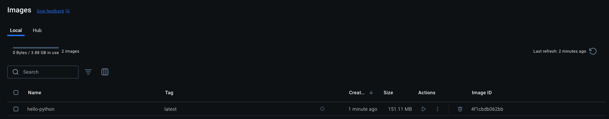
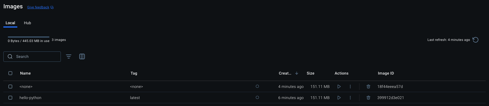
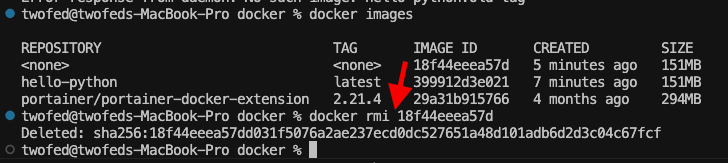
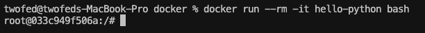
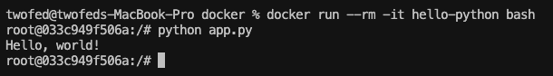

# Сборка образа

```bash
docker build -t hello-python .
```
Где '-t' используется для указания имени образа (в данном случае это hello-python),
а '.' используется для выбора текущей директории

В результате выполнения этой команды, мы получили образ hello-python



# Запуск контейнера
## Простой режим

```bash
docker run --rm hello-python
```

В результате выполнения этой команды, мы создали контейнер из образа hello-python, запустили его и удалили благодаря флагу --rm

Если изменить содержимое скрипта и запустить эту команду еще раз, то вывод не изменится, посколько скрипт уже вшит в образ. Образ нужно перестраивать.

Для этого можно использовать:
```bash
docker build -t hello-python .
```

Docker кэширует каждый слой образа. Если возникнут проблемы, можно собрать без кэширования

```bash
docker build --no-cache -t hello-python .
```

Старый образ также остается в реестре докера, его следует очистить



Для этого, посмотрим список образов в реестре

```bash
docker images
```
И удалим устаревший по id образа



```bash
docker rmi {IMAGE_ID}
```

## Интерактивный режим

```bash
docker run --rm -it hello-python bash
```

В таком режиме (-it и bash), мы запускаем контейнер и подключаемся к его консоли bash.



Теперь мы можем запустить скрипт прямо внутри контейнера

```bash
python app.py
```



Для отключения от контейнера и заврешения его работы, можно использовать команду exit

```bash
exit
```

## Использование volumes

В данном режиме мы не вшиваем наш скрипт напрямую в образ, а передаем ему нашу локальную папку, чтобы можно было быстро менять скрипт и проверять работу

```bash
docker run --rm -v $(pwd)/app.py:/app.py hello-python
```

Здесь флаг -v отвечает за volumes, а $(pwd) используется для получения пути до текущей папки

То есть мы берем файл app.py из текущей папки и заменяем им файл /app.py в контейнере

Это позволит нам делать изменения в скрипте локально и сразу запускать контейнер с обновленным файлом